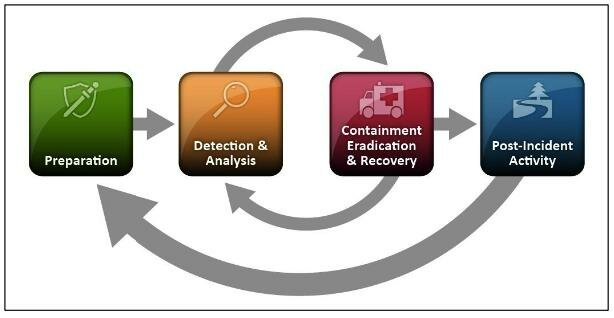

# Incident Handling Playbook - IHP
Incident Handling Playbook

### Resumo

O presente trabalho tem como objetivo propor um conjunto de playbooks para auxiliar no tratamento de incidentes de segurança cibernética, categorizados de acordo com uma taxonomia consolidada de incidentes. O trabalho abordará diversos tipos de incidentes, como ataques de negação de serviço distribuídos (DDoS), exfiltração de dados, exploração de vulnerabilidades, entre outros, e para cada um deles, serão apresentadas soluções específicas e metodologias de contenção. Cada playbook descreverá não apenas os passos recomendados para mitigação, mas também uma avaliação quantitativa da eficácia esperada para cada uma das contramedidas sugeridas.

Por exemplo, no caso de um ataque DDoS, o playbook poderá recomendar a habilitação de funcionalidades específicas no firewall, como o Sistema de Prevenção de Intrusões (IPS) e o bloqueio por geolocalização. Para cada uma dessas medidas, será oferecida uma análise de sua eficácia média, com base em dados empíricos ou estudos de caso anteriores. O objetivo final é fornecer às organizações uma ferramenta prática e padronizada para otimizar suas respostas a incidentes, ao mesmo tempo em que possibilita uma avaliação crítica sobre o impacto das contramedidas aplicadas.

Dessa forma, o trabalho contribui para a melhoria contínua dos processos de resposta a incidentes, auxiliando equipes de segurança a tomarem decisões mais informadas e baseadas em evidências durante situações críticas.

### Exemplo de taxonomias e suas referências

As taxonomias de incidentes de segurança cibernética são classificações que ajudam a categorizar e padronizar o tratamento e a resposta a diferentes tipos de incidentes. As principais organizações e frameworks, como NIST, ENISA, FIRST, CISA, Mitre ATT&CK, entre outros, fornecem diretrizes sobre como classificar e abordar esses incidentes. A seguir estão as principais categorias com base em frameworks de melhores práticas de órgãos públicos americanos e europeus:

#### 1. **Incidentes de Violação de Confidencialidade**
   - **Exfiltração de Dados**: Acesso não autorizado e extração de dados sensíveis ou confidenciais.  
     _Exemplo_: Vazamento de dados financeiros ou pessoais.
   - **Espionagem Cibernética**: Roubo de informações estratégicas, normalmente associado a espionagem corporativa ou governamental.  
     _Referências_: NIST SP 800-61r2, ENISA Threat Landscape.

#### 2. **Incidentes de Integridade**
   - **Manipulação de Dados**: Alteração ou modificação de dados de forma não autorizada.  
     _Exemplo_: Alteração de dados em sistemas bancários ou de saúde.
   - **Desfiguração de Sites (Website Defacement)**: Modificação maliciosa do conteúdo visual de um website.
   - **Ataques a Blockchain**: Manipulação de transações ou consenso em redes blockchain.  
     _Referências_: Mitre ATT&CK, CIS Controls.

#### 3. **Incidentes de Disponibilidade**
   - **Ataques de Negação de Serviço (DoS/DDoS)**: Interrupção de serviços ou sistemas pela sobrecarga de tráfego.  
     _Exemplo_: DDoS contra servidores web.
   - **Falhas de Infraestrutura**: Interrupção de serviços por falhas técnicas, como queda de rede ou falhas em servidores.
   - **Ransomware**: Bloqueio de acesso a dados ou sistemas, com exigência de pagamento para liberação.  
     _Referências_: NIST CSF, ENISA Threat Taxonomy.

#### 4. **Incidentes de Ameaças Internas (Insider Threats)**
   - **Ação Maliciosa por Colaborador**: Ações intencionais de funcionários ou ex-funcionários para causar danos à organização.  
     _Exemplo_: Roubo de propriedade intelectual por um empregado.
   - **Negligência**: Violações de segurança decorrentes de erro humano, como o uso inadequado de sistemas de segurança ou exposição acidental de dados.  
     _Referências_: CERT Insider Threat Guide, NIST SP 800-53.

#### 5. **Incidentes Relacionados a Malware**
   - **Vírus e Worms**: Software malicioso que se espalha por meio de infecções em arquivos ou redes.
   - **Spyware/Adware**: Programas que coletam informações ou exibem anúncios sem o consentimento do usuário.  
     _Exemplo_: Spyware coletando dados de uso de sistemas corporativos.  
     _Referências_: Mitre ATT&CK, CIS Controls.

#### 6. **Incidentes de Engenharia Social**
   - **Phishing**: Tentativas de enganar usuários para fornecer informações confidenciais.  
     _Exemplo_: E-mails fraudulentos para roubo de credenciais.
   - **Spear Phishing**: Ataque de phishing direcionado a uma pessoa ou organização específica, geralmente com base em informações personalizadas.
   - **Pretexting e Baiting**: Engano para obter informações ou enganar uma vítima com falsos pretextos.  
     _Referências_: NIST SP 800-61r2, ENISA Threat Landscape.

#### 7. **Incidentes de Exploração de Vulnerabilidades**
   - **Ataques de Dia Zero (Zero-Day)**: Exploração de vulnerabilidades ainda desconhecidas ou sem correções públicas.  
     _Exemplo_: Ataque a um sistema sem patch de segurança disponível.
   - **Exploração de Vulnerabilidades Conhecidas**: Exploração de falhas de segurança que já têm correções disponíveis, mas que não foram aplicadas pela organização.
   - **Ataques a Contêineres e Virtualização**: Vulnerabilidades específicas de infraestruturas de contêineres ou ambientes virtualizados.  
     _Referências_: Mitre CVE Program, NIST SP 800-53.

#### 8. **Incidentes Relacionados à Identidade e Autenticação**
   - **Furto de Credenciais**: Roubo de informações de autenticação, como senhas ou tokens.
   - **Ataques de Força Bruta**: Tentativa de adivinhar senhas ou chaves criptográficas por tentativa e erro.
   - **Uso Indevido de Contas Privilegiadas**: Uso malicioso ou não autorizado de contas de administração ou sistemas com privilégios elevados.  
     _Referências_: NIST Identity and Access Management, ENISA Guidelines.

#### 9. **Incidentes Relacionados a Redes**
   - **Escutas Clandestinas (Eavesdropping)**: Interceptação não autorizada de comunicações de rede.  
     _Exemplo_: Captura de pacotes de rede contendo informações sensíveis.
   - **Injeção de Pacotes Maliciosos**: Inserção de pacotes maliciosos para comprometer a integridade de uma rede ou sistema.  
     _Referências_: Mitre ATT&CK, NIST SP 800-115.

#### 10. **Incidentes de Uso de Serviços de Nuvem**
   - **Sequestro de Conta na Nuvem**: Controle não autorizado de contas de usuários em serviços de nuvem.
   - **Configurações Inseguras em Nuvem**: Exploração de falhas de configuração, como permissões excessivas ou falta de criptografia.
   - **Shadow IT**: Uso não autorizado de serviços de nuvem ou aplicações fora do controle de TI corporativa.  
     _Referências_: ENISA Cloud Security, NIST SP 800-144.

#### 11. **Incidentes Relacionados a Infraestruturas Críticas**
   - **Ataques a Sistemas de Controle Industrial (ICS/SCADA)**: Incidentes que visam a desestabilização ou comprometimento de infraestruturas críticas, como redes elétricas, transporte ou indústrias.
   - **Ataques a Infraestruturas de Telecomunicações**: Incidentes que impactam redes de telecomunicações, podendo resultar na interrupção de serviços essenciais.  
     _Referências_: NIST SP 800-82, ENISA Critical Infrastructure Protection.

Essas categorias ajudam as organizações a identificar rapidamente o tipo de incidente, escolher contramedidas adequadas e orientar as respostas de forma sistemática e eficaz.

## Fases do Ciclo de Vida de um Incidente Cibernético
### Resumo das Fases do Ciclo de Vida de um Incidente Cibernético segundo o NIST:

**1. Preparação**: Estabelecer e treinar a equipe de resposta a incidentes, adquirir ferramentas e recursos necessários, e implementar controles com base em avaliações de risco para minimizar o número de incidentes.

**2. Detecção e Análise**: Monitorar e identificar possíveis incidentes de segurança. A detecção é crucial para alertar a organização sobre ocorrências de incidentes, e a análise visa entender a natureza e o impacto desses incidentes.

**3. Contenção**: Conter o incidente para limitar seu impacto e impedir que ele se espalhe ou cause mais danos. Em muitos casos, é necessário realizar análises adicionais para identificar se o incidente se propagou para outros sistemas.

**4. Erradicação e Recuperação**: Remover o incidente da rede ou dos sistemas comprometidos, como eliminar malware ou fechar brechas de segurança. Após isso, a organização inicia a fase de recuperação, restaurando os sistemas afetados ao estado normal de operação.

**5. Atividades Pós-incidente**: Emitir relatórios que detalham a causa, o impacto e o custo do incidente. Essa fase também envolve a revisão de como o incidente foi tratado e a implementação de melhorias para prevenir incidentes futuros.

Para este trabalho, a proposta é focar na fase de **contenção**, demonstrando as técnicas, táticas e procedimentos possíveis para se conter um incidente de segurança cibernética.

## Referências
#### Computer Security Incident Handling Guide (https://nvlpubs.nist.gov/nistpubs/specialpublications/nist.sp.800-61r2.pdf)
#### Cybersecurity Incident & Vulnerability Response Playbooks (https://www.cisa.gov/sites/default/files/2024-08/Federal_Government_Cybersecurity_Incident_and_Vulnerability_Response_Playbooks_508C.pdf)
#### FIRST CSIRT Services Framework (https://www.first.org/standards/frameworks/csirts/csirt_services_framework_v2.1)
